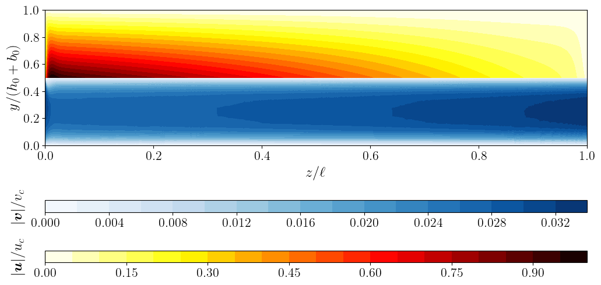

# soft-hydraulic-ale-fsi

Arbitrary Lagrangian&ndash;Eulerian fluid&ndash;structure interaction (FSI) solvers for [**soft hydraulics**](https://dx.doi.org/10.1088/1361-648X/ac327d) problems &mdash; pressure-driven flow sin compliant microchannels where the fluid and elastic solid are two-way coupled.

Built on [FEniCSx / DOLFINx](https://github.com/fenics/dolfinx) and customized specifically for 2D problems, using quasi-direct coupling for unsteady problems and a monolithic approach for steady problems.

## Purpose

Simulate and analyze the deformation of a soft elastic wall driven by viscous (and inertial) flow, targeting elastoinertial regimes relevant to microfluidics and soft robotics. The code supports both steady and transient problems, Newtonian and shear-thinning (Carreau) fluids, and benchmarking against analytical solutions.



## Repository contents

| File / folder | Description |
| --- | --- |
| `ALE-FSIx_2D.ipynb` | **Main transient solver** — time-dependent ALE-FSI simulation in DOLFINx |
| `ALE-FSIx_2D_steady.ipynb` | **Steady solver** — monolithic steady ALE-FSI formulation |
| `build_gmsh_x.py` | Mesh generation helper: two-subdomain (fluid + solid) rectangle mesh via gmsh, returns tagged DOLFINx mesh |
| `strip_widgets.py` | Utility to strip notebook widget metadata before committing |
| `dolfin-2019/` | Legacy solvers based on the original FEniCS (DOLFIN 2019) |
| `theory_steady/` | Analytical theory notebooks for steady FSI (including shear-thinning models) |
| `theory_oscillatory/` | Analytical theory notebooks for oscillatory/streaming FSI (elastoinertial rectification) in channels and tubes |

## Key features

- ALE-FSI discretization (fluid momentum + continuity + solid momentum + mesh motion coupled together)
- Monolithic steady solver and quasi-directly coupled unsteady solver (monolithic solid+fluid, separate mesh motion)
- Uses gmsh-based meshing with tagged subdomains and boundary facets
- Allows both velocity-inlet and pressure-inlet, both with pressure-outlet boundary conditions
- Implements Carreau viscosity model for shear-thinning fluids
- Implements 2D-restricted neo-Hookean solid with isochoric–volumetric splitting to handle strong compression for confined elastic layers
- Implements velocity-based damping in the unsteady solid momentum equation for robust convergence to steady state (if desired)
- Offers analytical steady-state benchmarks
- In-built post-processing and Matplotlib visualization

## Dependencies

- [FEniCSx / DOLFINx](https://github.com/fenics/dolfinx) (next-generation FEniCS), see [this useful guide](https://me.jhu.edu/nguyenlab/doku.php?id=fenicsx) for setting it up and customizing your environment
- [Gmsh](https://gmsh.info) Python API
- PETSc / petsc4py, MPI / mpi4py
- NumPy, SciPy, Matplotlib

### Cautionary note for DOLFIN version

To run the legacy codes from the `dolfin-2019` folder, it is recommended to use a fresh Conda environment, let's call it `fenics2019`, with this _precise_ command:

```bash
    conda create -n fenics2019 -c conda-forge fenics mshr
```

Any other installation order may result in `mshr` failing. Then, install any further Python tools and libraries through `pip install` rather than with `conda` to ensure that no dependencies get updated and break legacy `dolfin` and `mshr`. Complicated, I know. 😵‍💫

## Credits

Largely developed (ca. Fall 2025–Spring 2026) and maintained by [Ivan C. Christov](http://christov.tmnt-lab.org), Purdue University, with assistance from GitHub Copilot and Claude.

Initial unsteady code forked from an [earlier version](https://github.com/Radeu/Radeu-FSI-in-2D-Deformable-Channel-with-Oscillatory-Pressure-BC) based on David Kamensky's [fitted-fsi-example](https://github.com/david-kamensky/mae-207-fea-for-coupled-problems/tree/master/fsi).
