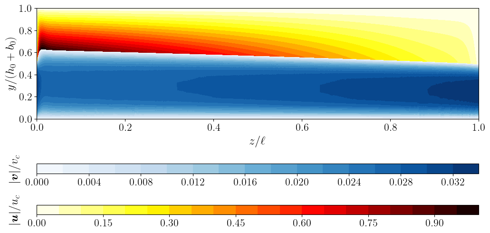

# soft-hydraulic-ale-fsi

[](https://doi.org/10.5281/zenodo.22970054)
[](LICENSE)
[](https://github.com/ichristov/soft-hydraulic-ale-fsi/commits/main)

Arbitrary Lagrangian&ndash;Eulerian fluid&ndash;structure interaction (FSI) solvers for [**soft hydraulics**](https://tmnt-lab.org/soft-hydraulics.html) problems &mdash; pressure-driven flows in compliant microchannels where the fluid and elastic solid are two-way coupled.

Built on [FEniCSx / DOLFINx](https://github.com/fenics/dolfinx) and customized specifically for internal flow problems, using quasi-direct coupling for unsteady problems and a monolithic approach for steady problems.



## Purpose

Simulate and analyze the deformation of a soft elastic wall driven by viscous (and inertial) flow, targeting elastoinertial regimes relevant to microfluidics and soft robotics. The code supports both steady and transient problems, generalized Newtonian fluids (for example, shear-thinning via Carreau viscosity model), and benchmarking against analytical solutions.

## Repository contents

The badges render a notebook in place, equations and stored outputs included &mdash; handy when GitHub's own preview times out on the larger solvers.

| File / folder | Description |
| --- | --- |
| `ALE-FSIx_2D.ipynb`<br>[![nbviewer][nbv]](https://nbviewer.org/github/ichristov/soft-hydraulic-ale-fsi/blob/main/ALE-FSIx_2D.ipynb) | **Main transient solver** — time-dependent ALE-FSI simulation in DOLFINx for 2D confined layer (classic "soft lubrication") configuration |
| `ALE-FSIx_2D_steady.ipynb`<br>[![nbviewer][nbv]](https://nbviewer.org/github/ichristov/soft-hydraulic-ale-fsi/blob/main/ALE-FSIx_2D_steady.ipynb) | **Steady solver** — monolithic steady ALE-FSI formulation for 2D confined layer (classic "soft lubrication" configuration) |
| `ALE-FSIx_3D_tapered_steady.ipynb`<br>[![nbviewer][nbv]](https://nbviewer.org/github/ichristov/soft-hydraulic-ale-fsi/blob/main/ALE-FSIx_3D_tapered_steady.ipynb) | **Steady solver** — monolithic steady ALE-FSI formulation for 3D cylindrical geometry (tapered fluid cylinder domain surrounded by tapered elastic cylinder domain and confined on the outside; type of "extruded tube" configuration) |
| `build_gmsh_x.py` | Mesh generation helper: two-subdomain (fluid + solid) rectangle mesh via gmsh, returns tagged DOLFINx mesh; builtin examples include 2D confined layer, 3D tapered cylindrical channel with annular elastic wall, 3D rectangular fluid channel with a top elastic wall |
| `strip_widgets.py` | Utility to strip notebook widget metadata before committing |
| `environment.yml` | Conda environment for the solvers and theory notebooks (see [Environment file](#environment-file)) |
| `dolfin-2019/` | Legacy solvers based on the original FEniCS (DOLFIN 2019) [⚠️ **not actively updated**] |
| `theory_steady/` | Analytical theory notebooks for steady FSI (including shear-thinning models) |
| `theory_oscillatory/` | Analytical theory notebooks for oscillatory/streaming FSI (elastoinertial rectification) in channels and tubes |

## Key features

- ALE-FSI discretization (fluid momentum + continuity + solid momentum + mesh motion coupled together)
- Monolithic steady solver and quasi-directly coupled unsteady solver (monolithic solid+fluid, separate mesh motion)
- Uses gmsh-based meshing with tagged subdomains and boundary facets
- Allows both velocity-inlet and pressure-inlet, both with pressure-outlet boundary conditions
- Implements Carreau viscosity model for shear-thinning fluids
- Implements neo-Hookean solid with isochoric–volumetric splitting to handle strong compression in corners, and special consideration for the 2D-restricted case
- Implements velocity-based damping in the unsteady solid momentum equation for robust convergence to steady state (if desired)
- Offers analytical steady-state benchmarks
- Features in-built post-processing and Matplotlib visualization

## Dependencies

- [FEniCSx / DOLFINx](https://github.com/fenics/dolfinx) (next-generation FEniCS), see [this useful guide](https://me.jhu.edu/nguyenlab/doku.php?id=fenicsx) for setting it up and customizing your environment
- [Gmsh](https://gmsh.info) Python API
- PETSc / petsc4py, MPI / mpi4py
- NumPy (&ge; 2.0, since the notebooks use `numpy.trapezoid`), SciPy, Matplotlib
- [adios4dolfinx](https://github.com/jorgensd/adios4dolfinx) for checkpointing, [PyVista](https://pyvista.org) for the 3D notebook

### Environment file

[`environment.yml`](environment.yml) builds everything needed for the FEniCSx solvers and the theory notebooks:

```bash
    conda env create -f environment.yml
    conda activate fenicsx
```

DOLFINx is pinned to the 0.10 series, which is what the solvers are tested against; the rest floats. There is no pip equivalent, since DOLFINx is not meaningfully installable from PyPI &mdash; use Conda or FEM on Colab. The legacy `dolfin-2019` solvers need their own environment, built as described below.

### Google Colab

If you'd like to run these codes without a local Python configuration, check out the helpful [FEM on Colab](https://fem-on-colab.github.io/) project. With just a few lines of code, and a brief execution, you'll be solving soft hydraulics problems in the cloud in no time!

### Cautionary note for DOLFIN version

To run the legacy codes from the `dolfin-2019` folder, it is recommended to use a fresh Conda environment, let's call it `fenics2019`, with this _precise_ command:

```bash
    conda create -n fenics2019 -c conda-forge fenics mshr
```

Any other installation order may result in `mshr` failing. Then, install any further Python tools and libraries through `pip install` rather than with `conda` to ensure that no dependencies get updated and break legacy `dolfin` and `mshr`. Complicated, I know. 😵‍💫

That fragility is also why the legacy stack gets no `environment.yml`: such a file invites `conda env update`, whose re-solve is exactly what breaks `mshr`.

## Citing this code

If these solvers contribute to your research, please cite the archived software release. Each release is deposited on Zenodo and has its own DOI; the DOI above is the _concept_ DOI, which always resolves to the latest version. Cite the version you actually ran when you can.

```bibtex
@software{soft-hydraulic-ale-fsi,
  author    = {Christov, Ivan C.},
  title     = {{soft-hydraulic-ale-fsi}: Arbitrary Lagrangian--Eulerian
               fluid--structure interaction solvers for soft hydraulics},
  year      = {2026},
  publisher = {Zenodo},
  doi       = {10.5281/zenodo.22970054},
  url       = {https://github.com/ichristov/soft-hydraulic-ale-fsi}
}
```

GitHub also builds this citation for you from [`CITATION.cff`](CITATION.cff) &mdash; use the "Cite this repository" button in the sidebar, which offers both BibTeX and APA.

The theory each notebook implements or benchmarks against is cited in the notebook itself, next to the equations it belongs to; please cite those papers too where you rely on them.

## Publications using this code

- Uday M. Rade, Shrihari D. Pande &amp; Ivan C. Christov, "Theory and simulation of elastoinertial rectification of oscillatory flows in two-dimensional deformable rectangular channels," _Physical Review Fluids_ **11** (2026) 074102, [doi:10.1103/zk9v-13sn](https://doi.org/10.1103/zk9v-13sn); preprint [arXiv:2505.22799](https://arxiv.org/abs/2505.22799); simulation code and data in the PURR dataset [doi:10.4231/50C7-HK87](https://dx.doi.org/10.4231/50C7-HK87). Used the legacy `dolfin-2019` solver, whose initial version was written for these simulations.

## Credits

Largely developed (ca. Fall 2025–Spring 2026) and maintained by [Ivan C. Christov](http://christov.tmnt-lab.org), Purdue University, with assistance from GitHub Copilot and Claude.

Initial unsteady code forked from an [earlier version](https://github.com/Radeu/Radeu-FSI-in-2D-Deformable-Channel-with-Oscillatory-Pressure-BC) based on David Kamensky's [fitted-fsi-example](https://github.com/david-kamensky/mae-207-fea-for-coupled-problems/tree/master/fsi).

[nbv]: https://raw.githubusercontent.com/jupyter/design/master/logos/Badges/nbviewer_badge.svg
